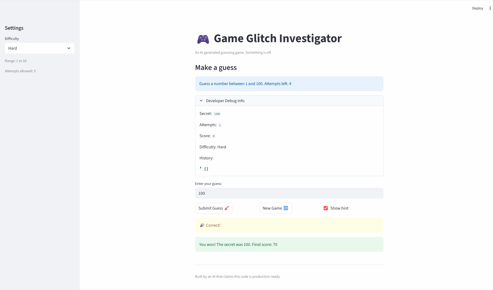

# 🎮 Game Glitch Investigator: The Impossible Guesser

# NB:
### App Web Dashboard

### `What was/were broken?`  
- Game keeps saying go lower even after 1 was entered. Mathematically backward given that's the lowest expected possible value In check_guess, when guess > secret
- New Game button feature doesn't reset the game.
- Inconsistent range, going higher also shows the same issue as going lower e.g., when 99 was entered it says go higher, 
100 was entered it says go higher, 1000000, despite supassing the required stipulated upper limit range etc.
- Difficulty level has no impact on game.

### `Logic Flaws`  
- String Type error when randomly converting secret to a string. E.g. a conversion of 50 > "20" will always lead to a TypeError as noticed in broken hints.
- Function update_score adds point even if one gesses too high on even-numbered attemps.
  
### `Debugging and recommended fixes`
- Review check_guess: consider swapping return message guess > secret to say "Lower"
- Type enforcement: INT comparisons for secret & guess
- Consider clean logical flow and award points for correct guesses only and subract for wrong guesses.

## Summary & Developer Habits:
- Always perform unit tests before deploying to UI.
- AI Help: AI can be helpful in locating concrete issues, impact explanation and targeted improvement suggestions.
- Streamlit: The way Streamlit runs top to bottom, keeps changing secret number fix by stabilizing random.randint so that the number is only picked once saving session state.
- Create test case independenctly and ask AI to do the same and then compare.
- AI Thoughts: AIs can be great and can also be confidently wrong, AI should be used as a collaborator or for 1st draft, but always double-check it recommendation / work. <strong> "Trust but Verify Always!"</strong>

# NB END:

## 🚨 The Situation

You asked an AI to build a simple "Number Guessing Game" using Streamlit.
It wrote the code, ran away, and now the game is unplayable. 

- You can't win.
- The hints lie to you.
- The secret number seems to have commitment issues.

## 🛠️ Setup

1. Install dependencies: `pip install -r requirements.txt`
2. Run the broken app: `python -m streamlit run app.py`

## 🕵️‍♂️ Your Mission

1. **Play the game.** Open the "Developer Debug Info" tab in the app to see the secret number. Try to win.
2. **Find the State Bug.** Why does the secret number change every time you click "Submit"? Ask ChatGPT: *"How do I keep a variable from resetting in Streamlit when I click a button?"*
3. **Fix the Logic.** The hints ("Higher/Lower") are wrong. Fix them.
4. **Refactor & Test.** - Move the logic into `logic_utils.py`.
   - Run `pytest` in your terminal.
   - Keep fixing until all tests pass!

## 📝 Document Your Experience

- [ ] Describe the game's purpose.
- [ ] Detail which bugs you found.
- [ ] Explain what fixes you applied.

## 📸 Demo

- [ ] [Insert a screenshot of your fixed, winning game here]

## 🚀 Stretch Features

- [ ] [If you choose to complete Challenge 4, insert a screenshot of your Enhanced Game UI here]
